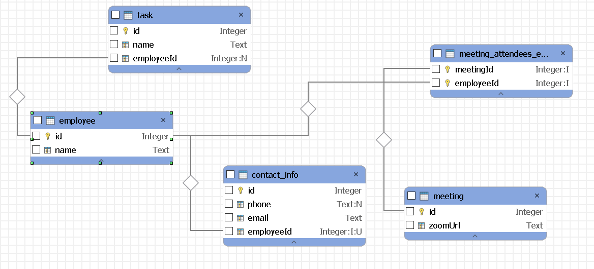

## Description

Nest Js TypeOrm Refresher

## Installation

```bash
$ npm install
```

## Running the app

```bash
# development
$ npm run start

# watch mode
$ npm run start:dev

# production mode
$ npm run start:prod
```

## Entity

Employee

- id
- name
- managerId

ContactInfo

- id
- phone
- email
- employeeId

Task

- id
- name
- eployeeid

Meeting

- id
- zoomUrl


